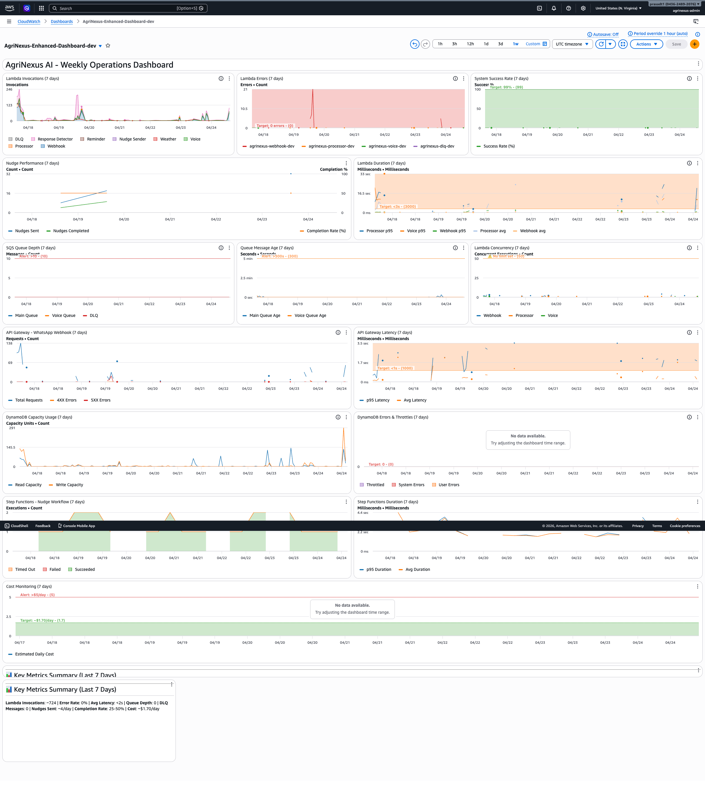

# Perfect Dashboard Screenshot Guide for Article

## 🎯 Goal
Capture a professional, high-quality screenshot of the enhanced CloudWatch dashboard for your article.

## 📋 Pre-Screenshot Checklist

### 1. Verify Dashboard is Live
```bash
aws cloudwatch list-dashboards --region us-east-1 --query "DashboardEntries[?contains(DashboardName, 'Enhanced')]"
```
✅ Should show: `AgriNexus-Enhanced-Dashboard-dev` with recent LastModified timestamp

### 2. Ensure Recent Data
The dashboard shows last 7 days of data. Your system has been running, so data should be present.

## 🖥️ Screenshot Steps

### Step 1: Open Dashboard
Click this URL:
```
https://console.aws.amazon.com/cloudwatch/home?region=us-east-1#dashboards:name=AgriNexus-Enhanced-Dashboard-dev
```

Or navigate manually:
1. AWS Console → CloudWatch
2. Dashboards (left sidebar)
3. Click "AgriNexus-Enhanced-Dashboard-dev"

### Step 2: Configure View Settings

#### Time Range
- Click the time range dropdown (top right)
- Select: **"Last 7 days"**
- This shows weekly trends (matches your article context)

#### Refresh Settings
- Set auto-refresh to **"Off"** (prevents mid-screenshot updates)
- Or click "Refresh" once to get latest data, then pause

#### Full Screen Mode
- Click **"Actions"** button (top right)
- Select **"View in full screen"**
- This removes AWS console chrome for cleaner screenshot

### Step 3: Wait for All Widgets to Load
- Scroll through entire dashboard
- Ensure all 15 widgets show data (not "Loading...")
- Look for any error messages (should be none)

### Step 4: Position for Screenshot

#### Option A: Full Dashboard (Recommended)
- Scroll to top
- Zoom browser to fit entire dashboard (Cmd/Ctrl + `-` to zoom out)
- Aim for ~80-90% zoom so all widgets are visible
- Header should be at top, footer at bottom

#### Option B: Key Sections Only
If full dashboard is too large, capture in sections:
1. **Header + Operations** (widgets 1-3)
2. **Business Metrics** (widgets 4-5)
3. **Infrastructure** (widgets 6-11)
4. **Cost + Footer** (widgets 12-15)

### Step 5: Take Screenshot

#### Mac
```bash
# Full screen
Cmd + Shift + 3

# Select area (recommended)
Cmd + Shift + 4
# Then drag to select dashboard area
```

#### Windows
```bash
# Snipping tool
Win + Shift + S
# Then drag to select area
```

#### Linux
```bash
# GNOME
Shift + PrtScn
# Then select area
```

### Step 6: Save and Name
- Save as: `agrinexus-dashboard-enhanced.png`
- Location: Project root or `docs/images/`
- Format: PNG (better quality than JPG for dashboards)

## 🎨 Screenshot Quality Tips

### Resolution
- **Minimum**: 1920x1080 (Full HD)
- **Recommended**: 2560x1440 (2K) or higher
- **Retina/HiDPI**: Even better for article

### Zoom Level
- **Too zoomed in**: Widgets cut off, need scrolling
- **Too zoomed out**: Text becomes unreadable
- **Sweet spot**: 80-90% browser zoom, all widgets visible

### Lighting (for screen photos)
- Use screenshot tools, not phone camera
- If using phone: no glare, straight angle, good lighting

### Cropping
- Include header (shows system status)
- Include footer (shows key metrics summary)
- Remove AWS console navigation if visible
- Keep all 15 widgets in frame

## 📊 What Should Be Visible

### Must-Have Elements
✅ Dashboard title: "AgriNexus AI - Weekly Operations Dashboard"
✅ System status: "✅ Operational | Active Users: 7 | Monthly Cost: ~$53"
✅ All 15 widgets with data
✅ Time range indicator: "Last 7 days"
✅ Footer summary: "Lambda Invocations: ~724 | Error Rate: 0%..."

### Data to Highlight
- **Green metrics**: 0% error rate, 100% uptime
- **Business KPIs**: Nudges sent/completed, completion rate
- **Cost tracking**: $1.70/day with target lines
- **Concurrency warning**: Orange annotation (shows production readiness awareness)

## 🚫 Common Mistakes to Avoid

❌ **Don't**: Capture while widgets are still loading
❌ **Don't**: Include AWS console navigation bars
❌ **Don't**: Use phone camera (use screenshot tool)
❌ **Don't**: Crop out header or footer
❌ **Don't**: Capture with "No data" messages
❌ **Don't**: Show sensitive data (phone numbers, etc.)

✅ **Do**: Wait for all widgets to load
✅ **Do**: Use full screen mode
✅ **Do**: Capture entire dashboard in one shot
✅ **Do**: Use high resolution
✅ **Do**: Verify all metrics are visible

## 📝 Article Caption Suggestions

### Option 1: Comprehensive
```
AgriNexus AI CloudWatch Dashboard showing 7 days of operational metrics. 
The system maintains 100% uptime with 0% error rate, processing ~724 Lambda 
invocations per week. Business metrics show ~4 nudges sent daily with 25-50% 
completion rate, all at $1.70/day (~$53/month for 7 users).
```

### Option 2: Concise
```
Enhanced CloudWatch dashboard monitoring AgriNexus AI operations, business KPIs, 
and cost metrics across 15 widgets. System shows 100% reliability with $1.70/day 
operational cost.
```

### Option 3: Technical
```
Production CloudWatch dashboard with 15 widgets tracking Lambda invocations, 
error rates, queue depth, API latency, DynamoDB usage, Step Functions workflows, 
and cost metrics. Annotations highlight SLA thresholds and production readiness gaps.
```

## 🔍 Post-Screenshot Verification

### Check Image Quality
1. Open saved PNG file
2. Zoom to 100%
3. Verify text is readable
4. Check all widgets are visible
5. Ensure no sensitive data visible

### File Size
- **Expected**: 200KB - 2MB (depending on resolution)
- **Too small** (<100KB): Might be over-compressed
- **Too large** (>5MB): Consider optimizing

### Optimization (Optional)
```bash
# Install ImageMagick (if needed)
brew install imagemagick  # Mac
apt-get install imagemagick  # Linux

# Optimize PNG
convert agrinexus-dashboard-enhanced.png -quality 95 -resize 2560x agrinexus-dashboard-enhanced-optimized.png
```

## 📤 Using in Article

### Markdown
```markdown

*Figure 1: Enhanced CloudWatch dashboard showing 7 days of operational and business metrics*
```

### HTML
```html

<p><em>Figure 1: Enhanced CloudWatch dashboard showing 7 days of operational and business metrics</em></p>
```

## 🎯 Success Criteria

Your screenshot is ready for the article when:
- ✅ All 15 widgets are visible and loaded
- ✅ Time range shows "Last 7 days"
- ✅ Header and footer are included
- ✅ Text is readable at article size
- ✅ No AWS console chrome visible
- ✅ No sensitive data exposed
- ✅ File size is reasonable (<2MB)
- ✅ Format is PNG (not JPG)

## 🚀 Quick Command Reference

```bash
# Verify dashboard exists
aws cloudwatch list-dashboards --region us-east-1 | grep Enhanced

# Open dashboard URL (Mac)
open "https://console.aws.amazon.com/cloudwatch/home?region=us-east-1#dashboards:name=AgriNexus-Enhanced-Dashboard-dev"

# Take screenshot (Mac)
# Press: Cmd + Shift + 4, then drag to select

# Verify screenshot
ls -lh agrinexus-dashboard-enhanced.png
open agrinexus-dashboard-enhanced.png
```

---

**Ready to capture?** Follow steps 1-6 above, and you'll have a professional dashboard screenshot for your article! 📸
