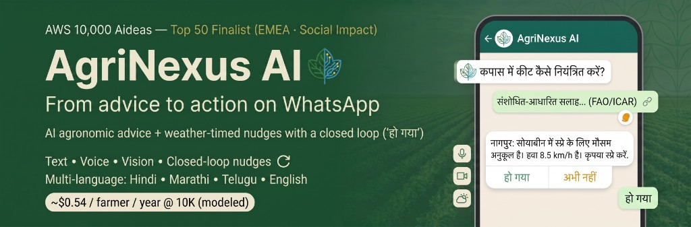
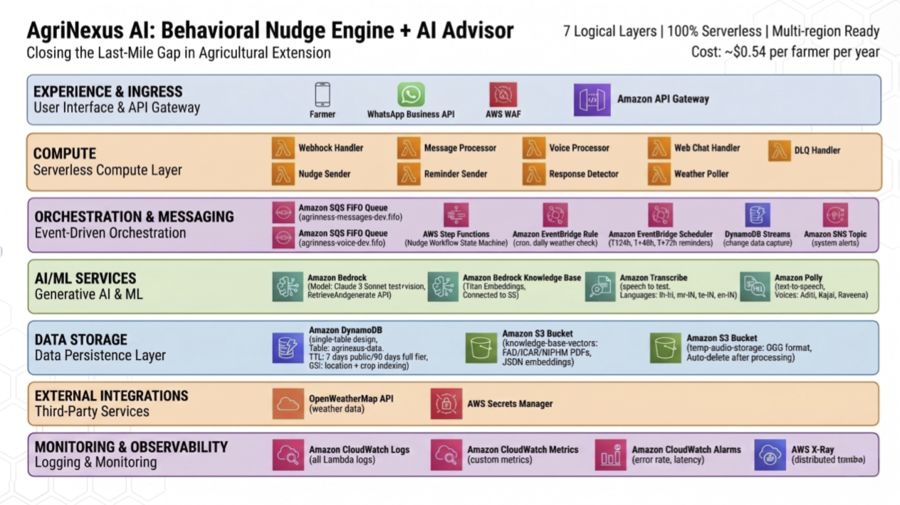

# AgriNexus AI – WhatsApp Agricultural Advisory

**From advice to action on WhatsApp.** AI-powered agronomic advice and weather-timed nudges for smallholder farmers — in their language, on WhatsApp. Built on **AWS Serverless** + **Amazon Bedrock** with a requirements-driven workflow (**Kiro** + **EARS**).

---

**Why it matters.** India has [\~126 million](https://www.fao.org/fileadmin/templates/ess/ess_test_folder/World_Census_Agriculture/WCA_2020/WCA_2020_new_doc/IND_REP_ENG_2015_2016.pdf) smallholder farmers. They don't lose crops because advice doesn't exist — they lose crops because advice arrives after the spray window closes. Extension officers are stretched [1:5,000 against a guideline norm of 1:750](https://m.thewire.in/article/agriculture/from-data-to-decisions-what-bharat-vistaar-needs-to-transform-indian-agriculture). The knowledge is there; the follow-through isn't.

**What I built.** A 1:1 advisor on every farmer's phone — accessible on the WhatsApp they already use, no app install, grounded in [ICAR](https://icar.org.in/) + [FAO](https://www.fao.org/) research, responsive in Hindi / Marathi / Telugu / English, and most importantly — a closed accountability loop that follows up until the farmer confirms "हो गया" (done) or opts out.

**Designed for scale.** Modeled at **[\~$0.54 per farmer per year at 10,000 active farmers](#cost-breakdown)** on fully serverless AWS. Currently running production at **\~$53/month / \~$1.70/day**. Zero adoption friction: WhatsApp is installed on 500M+ Indian phones. Zero training: tap buttons in your dialect, onboard in under 60 seconds.

**The differentiator.** The closed-loop nudge engine. Most agri-AI tools stop at delivering advice. AgriNexus tracks whether the advice was acted on — advice plus accountability, not just information.

---

> ### 🏆 AWS Builder 10,000 AIdeas — Top 50 Finalist (EMEA · Social Impact)
> 
> **For judges, reviewers, and fellow builders — three fastest paths in:**
> 
> | Path | Link | Time |
> | --- | --- | --- |
> | 🎥 **Watch the demo** | [youtu.be/Hr9EcblzkwI](https://youtu.be/Hr9EcblzkwI) | 3 min |
> | 💬 **Try on WhatsApp** | [wa.me/4915120105731](https://wa.me/4915120105731) | 1 min |
> | 📖 **Read the finalist article** | [AWS Builder Center](https://builder.aws.com/content/3C8hBRTcsRuQrHzE3Pq243yhXTF/aideas-finalist-agrinexus-ai) | 5 min |
> 
> **TL;DR:** The closed-loop nudge engine is the core differentiator against named peers (Farmer.Chat, iSDA, AgriChat.AI, Weather Impact). Weather-gated reminders that follow up at T+24h and T+48h, cancelled instantly when the farmer confirms action. 100% serverless. \~$0.54/farmer/year at 10K scale.

[](https://aws.amazon.com/serverless/)
[](https://aws.amazon.com/bedrock/)
[](https://www.whatsapp.com/business/platform/)
[](https://www.python.org/)
[](https://aws.amazon.com/sqs/)
[](https://aws.amazon.com/dynamodb/)
[](https://kiro.ai/)
[](https://en.wikipedia.org/wiki/Easy_Approach_to_Requirements_Syntax)

---

## Contents

- [🏆 Finalist Quickstart](#-aws-builder-10000-aideas--top-50-finalist-emea--social-impact)
- [Production Evidence](#production-evidence)
- [Try It Yourself](#try-it-yourself)
- [Architecture](#architecture)
- [Usage](#usage)
- [Testing](#testing)
- [Quick Start (Deploy)](#quick-start-deploy-your-own)
- [Cost Breakdown](#cost-breakdown)
- [Honest Tradeoffs](#honest-tradeoffs)
- [Monitoring](#monitoring)
- [Requirements Methodology: EARS](#requirements-methodology-ears)
- [Productization Roadmap](#productization-roadmap)
- [Partnerships & commercialization](#partnerships--commercialization)
- [Acknowledgments](#acknowledgments)
- [Documentation](#documentation)
- [License](#license)

---

## Production Evidence

AgriNexus is a working system with full production observability — not a prototype.

### Live Endpoints

| Endpoint | Status | URL |
| --- | --- | --- |
| WhatsApp Business number | ✅ Live | [wa.me/4915120105731](https://wa.me/4915120105731) |
| Web demo (public) | ✅ Live | [demo.agrinexus-ai.farm](https://demo.agrinexus-ai.farm/web-demo/live-2026-04-13b.html) |
| Webhook API (Meta verified) | ✅ Live | API Gateway + WAF |
| Health endpoint (liveness) | ✅ Live | [health](https://h4bt24ycdl.execute-api.us-east-1.amazonaws.com/dev/health) |
| Weather API integration | ✅ Live | OpenWeatherMap via Secrets Manager |

### Engineering Quality

| Metric | Value |
| --- | --- |
| Test-to-code ratio | **80%** ([metrics](docs/IMPLEMENTATION-QUALITY-METRICS.md) · [how I got there](docs/IMPLEMENTATION-QUALITY-METRICS.md#14-test-coverage-improvement-journey)) |
| Infrastructure-as-Code resources (SAM) | **34** ([template.yaml](template.yaml)) |
| Architecture Decision Records (ADRs) | **10** ([docs/adr/](docs/adr/)) |
| EARS requirements traced to code | **144** ([docs/requirements.md](docs/requirements.md)) |
| Lambda functions deployed | **11** |
| CI/CD workflows | **2** ([ci.yml](.github/workflows/ci.yml) + [aws-smoke.yml](.github/workflows/aws-smoke.yml)) |
| Lines of Python | **\~6,000** across 11 services |

### Live Production Metrics (rolling 7-day snapshot)

Real numbers from the running production stack — not projections.

**Reliability**

| Metric | Value | Status |
| --- | --- | --- |
| System uptime (7d) | **100%** | ✅ |
| Error rate | **0%** | ✅ |
| DLQ messages | **0** | ✅ |
| Lambda errors (last 3 days) | **0** | ✅ |
| DynamoDB throttles | **0** | ✅ |
| Step Functions failures | **0** | ✅ |

**Performance**

| Metric | p95 | Target | Status |
| --- | --- | --- | --- |
| Webhook latency | **<500ms** | <1s | ✅ |
| Processor latency | **<3s** | <5s | ✅ |
| Voice latency (end-to-end) | **~20–34s** | <60s | ✅ |
| Queue processing time | **<1s** | <5s | ✅ |

**Throughput**

| Metric | Value |
| --- | --- |
| Lambda invocations | ~**724/week** |
| WhatsApp messages processed | ~**115/week** |
| Web demo requests | ~**50/week** |
| Weather polls | **28/week** (4×/day) |

**Cost (actuals + projections)**

| Metric | Value |
| --- | --- |
| Daily cost (current) | **\~$1.70/day** |
| Monthly cost (current) | **\~$53/month** |
| Cost alarm threshold | $5/day (never tripped) |
| Cost at 10K farmers (modeled) | **\~$0.54/farmer/year** |
| Savings vs. Step Functions Wait State approach | **\~67× cheaper** |

### Observability & Alarms

**8 active alarms** publishing to SNS topic `agrinexus-alerts-{env}`:

| Alarm | Threshold | Status |
| --- | --- | --- |
| Nudge workflow failures | >0 failures | ✅ Armed |
| Cost alert | >$5/day | ✅ Armed |
| Webhook / Processor / Voice / Web Chat errors | >5 in 5min | ✅ Armed (4 alarms) |
| SQS queue backlog | Age >300s | ✅ Armed |
| DLQ depth (messages + voice) | >5 messages | ✅ Armed (2 alarms) |

**CloudWatch Dashboard:** 9 widgets covering Lambda, SQS, API Gateway, DynamoDB, Step Functions, and custom business metrics (nudges sent vs. completed). Template: [`dashboards/cloudwatch-dashboard.json`](dashboards/cloudwatch-dashboard.json). Screenshots: [1-week view](docs/visuals/cloudwatch-dashboard-1w.png) · [enhanced view](docs/visuals/agrinexus-dashboard-enhanced.png).

**Full metrics & monitoring breakdown:** [`docs/METRICS-AND-MONITORING.md`](docs/METRICS-AND-MONITORING.md) (business KPIs, operational metrics, cost breakdown, security, reliability, and observability roadmap).

### Capability Coverage

| Pipeline | Production status |
| --- | --- |
| 📝 Text RAG (Hindi / Marathi / Telugu / English) | ✅ End-to-end |
| 🎙️ Voice round-trip (Transcribe + RAG + Polly) | ✅ End-to-end, ~20–34s |
| 📷 Vision (Claude Vision, structured schema) | ✅ End-to-end |
| 🔔 Weather-gated nudges + closed loop | ✅ End-to-end, T+24h/T+48h/T+72h expiry |
| 🔒 Security (Meta HMAC-SHA256, secrets in Secrets Manager, PII redaction) | ✅ Enforced |
| 📊 Observability (CloudWatch + X-Ray + custom metrics) | ✅ Enforced |

### Security & Compliance

| Control | Status | Evidence |
| --- | --- | --- |
| Meta HMAC-SHA256 signature verification | ✅ Always on | No bypass possible |
| Per-user rate limiting | ✅ Active | 25 msgs/hour |
| PII redaction in logs | ✅ Active | Phone numbers shown as `491***` |
| IAM least-privilege | ✅ Enforced | DynamoDB / S3 / Bedrock resource-scoped |
| Encryption at rest | ✅ Active | DynamoDB default encryption |
| Encryption in transit | ✅ Active | HTTPS only |
| Data retention TTL | ✅ Active | Conversations 90d / MSG rows 7d / Nudges 180d / WAMID dedup 24h |

### Judge Note

> All numbers above are **verifiable in the repository and live CloudWatch dashboards** — see [SAM template](template.yaml), [ADRs](docs/adr/), [EARS requirements](docs/requirements.md), [CI workflows](.github/workflows/), and the [full metrics report](docs/METRICS-AND-MONITORING.md). 
> 
> Cost figures at scale (\~$0.54/farmer/year at 10K) are **modeled**; current production costs (\~$1.70/day, \~$53/month) are **real** — see [finops-public.md](docs/finops-public.md) for assumptions.

---

## Try It Yourself

Pick the web demo or WhatsApp experience.

| **🌐 Web demo** | **💬 WhatsApp** |
|--------------|--------------|
| [Try web demo](https://demo.agrinexus-ai.farm/web-demo/live-2026-04-13b.html) (no phone number) | [Open WhatsApp (wa.me)](https://wa.me/4915120105731) |
| **Includes:** Text Q&A (RAG), optional image | **Includes:** Onboarding + text (public); voice/photo/nudges (allowlisted) |
| **Best for:** Instant tryout in a browser | **Best for:** Full channel UX (buttons, voice, nudges) |
| **Privacy:** No login; anonymous `client_id` in browser storage for rate limits | **Privacy:** WhatsApp number required |
| **Limits:** ~5 questions/hour per IP + client; API Gateway + WAF caps | **Limits:** Rich features are allowlisted |

**WhatsApp access:** Text is open; voice/photo/nudges are available via the [demo request template](https://github.com/prasadt1/agrinexus-ai/issues/new?template=demo-request.md).

**Phone format (international):** The `wa.me` link works globally in most regions. If it doesn’t open, save the number as `+49 151 2010 5731` and message “HELP”.

**Data retention (summary):** Conversation rows written by the **processor** use a **90-day** TTL; short-lived **`MSG#*`** rows written by the **webhook** for the response detector use **7 days**; **WAMID** dedup keys use **24 hours**; **nudge** records use **180 days**. `demo_tier: public` limits **nudge follow-up scheduling**, not those TTLs. Details: [docs/testing/E2E-TEST-CHECKLIST.md](docs/testing/E2E-TEST-CHECKLIST.md) (section 6).

## Architecture



- **Onboarding**: language → district (**Latur**, **Jalna**, **Nagpur**) → crop → nudge consent (`src/processor/handler.py`).
- **Serverless**: Lambda, DynamoDB, SQS, EventBridge Scheduler, Step Functions
- **AI**: Amazon Bedrock (Claude 3 Sonnet + Knowledge Base RAG), Transcribe, Polly, Claude Vision
- **Messaging**: WhatsApp Business Platform (Cloud API)
- **Storage**: DynamoDB single-table design, S3 for knowledge base sources + temp audio/images
- **Abuse / cost controls**:
  - WhatsApp **webhook**: Meta signature verification + per-user message rate limits (defaults in `template.yaml`)
  - Public **web chat**: per-IP + per-client caps + API Gateway throttling + WAF on `/chat`
- **Cost**: modeled **\~$53/month for 1,000 farmers** (pay-per-use). See [Cost breakdown](#cost-breakdown)

**Diagrams:** See [architecture/diagrams.md](architecture/diagrams.md) for Mermaid diagrams (high-level, webhook, text/voice/image flows, nudge flow). Full design: [docs/architecture.md](docs/architecture.md).

## Usage

### HELP Command
Send `HELP` (or `मदद`, `मदत`, `సహాయం`) to see available features.

### Text Questions
```
User: कपास में कीट कैसे नियंत्रित करें?
Bot: कपास में कीटों को नियंत्रित करने के लिए...
```

### Voice Input
Send a voice note asking your question - it will be transcribed and answered.

### Image Analysis
Send a photo of your crop - the bot will identify pests/diseases and provide recommendations.

### Behavioral Nudges
If you consent during onboarding, you'll receive weather-based spray reminders:
```
Bot: आज स्प्रे करने के लिए अच्छा मौसम है। हवा 8.5 km/h है और बारिश नहीं होगी। क्या आपने स्प्रे कर दिया?

कृपया "हो गया" भेजें जब आप स्प्रे कर लें।

User: हो गया
Bot: बढ़िया! आपने स्प्रे कर दिया। धन्यवाद!
```

## Testing

### CI (GitHub Actions)

On every push/PR to `main`, **`.github/workflows/ci.yml`** runs fast unit tests (`tests/test_nudge_flow.py`, `tests/test_district_helplines.py`) and **`sam validate --lint`** on `template.yaml`. Optional **`aws-smoke.yml`** (`workflow_dispatch`) can run golden KB tests when repository secrets are configured.

### One-command smoke (local or CI agent)

From repo root:

```bash
./scripts/e2e-smoke.sh
# Optional: export KNOWLEDGE_BASE_ID=... and WEB_CHAT_URL=https://...execute-api.../dev/chat
```

### Text RAG
```bash
# Integration tests call Bedrock; set a real KB ID or tests skip:
export KNOWLEDGE_BASE_ID=YOUR_KB_ID
pytest tests/test_golden_questions.py -v
```
Without **`KNOWLEDGE_BASE_ID`**, parametrized golden tests **skip** (see `tests/test_golden_questions.py`).

### Voice Input
```bash
# Test with your own voice recording (language codes: hi-IN, mr-IN, te-IN, en-IN)
python tests/test_voice_simple.py path/to/audio.mp3 hi-IN
```

### Vision Analysis
```bash
# Test with crop image
python tests/test_vision.py path/to/image.jpg en cotton
```

### End-to-End Voice Round-Trip
```bash
# Voice in → Transcribe → RAG → Voice out
python tests/test_voice_end_to_end.py
```

### End-to-End (All Features)

See [docs/E2E-TEST-GUIDE.md](docs/E2E-TEST-GUIDE.md) for testing onboarding, Q&A, voice, vision, and nudges. For a **pre-demo pass/fail list**, use **[docs/testing/E2E-TEST-CHECKLIST.md](docs/testing/E2E-TEST-CHECKLIST.md)**.

**Webhook scripts:** create **`scripts/demo.env`** (not committed) with at least **`WEBHOOK_URL`**, **`APP_SECRET`** (if signatures are on), and **`PHONE_NUMBER`**. Scripts such as **`reset-onboard-and-demo.sh`**, **`test-complete-flow.sh`**, and **`demo-nudge-loop.sh`** source it when present.

### Reset profile / re-onboarding

- **DynamoDB only (no Meta HTTP):** `./scripts/reset-profile.sh <your_e164_digits>` (digits only, no `+`; or set **`PHONE_NUMBER`** in `demo.env` and run with no args). Wraps **`delete-user-data.sh`** with confirmation skipped.
- **Full scripted webhook flow:** `./scripts/reset-onboard-and-demo.sh --phone <digits>` (requires `WEBHOOK_URL`; see `usage()` in that script).

Then send a new language choice in WhatsApp to restart onboarding.

## Quick start (deploy your own)

### Prerequisites

```bash
# Install AWS SAM CLI
brew install aws-sam-cli  # macOS
# or: pip install aws-sam-cli

# Install Python dependencies
pip3 install boto3 pytest

# Configure AWS credentials
aws configure
```

### Deployment

```bash
# 1. Deploy infrastructure (recommended: samconfig.toml)
sam build --template-file template.yaml
sam deploy --config-file samconfig.toml

# Manual alternative (match parameters in samconfig.toml, including TableStreamArn):
# sam deploy --template-file .aws-sam/build/template.yaml \
#   --stack-name agrinexus-week2 \
#   --capabilities CAPABILITY_IAM CAPABILITY_NAMED_IAM \
#   --resolve-s3 \
#   --parameter-overrides "Environment=dev TableName=agrinexus-data TableStreamArn=arn:aws:dynamodb:REGION:ACCOUNT:table/TABLE/stream/... KnowledgeBaseId=YOUR_KB_ID GuardrailId='' GuardrailVersion=1"

# 2. Configure WhatsApp secrets
aws secretsmanager create-secret \
  --name agrinexus/whatsapp/verify-token \
  --secret-string "YOUR_VERIFY_TOKEN"

aws secretsmanager create-secret \
  --name agrinexus/whatsapp/app-secret \
  --secret-string "YOUR_APP_SECRET"

aws secretsmanager create-secret \
  --name agrinexus/whatsapp/access-token \
  --secret-string "YOUR_PERMANENT_ACCESS_TOKEN"

aws secretsmanager create-secret \
  --name agrinexus/whatsapp/phone-number-id \
  --secret-string "YOUR_PHONE_NUMBER_ID"

# 3. Configure Meta webhook
# Go to Meta Developer Portal → WhatsApp → Configuration
# Set Callback URL to your webhook URL (from deployment output)
# Subscribe to 'messages' field
```

### Knowledge base setup

**Important**: The source PDF documents are **not included in this repository** due to copyright considerations. You need to obtain and upload them separately.

See [data/fao-pdfs/README.md](data/fao-pdfs/README.md) for:
- List of required documents with download links
- Copyright and licensing information
- Instructions for uploading to S3
- Alternative knowledge sources
- **URL manifests (cotton / wheat / soybean):** tracked CSVs under `data/fao-pdfs/` (`kb_url_manifest_all.csv`, `kb_url_manifest_download.csv`, `kb_url_manifest_manual.csv`) and helper script **`scripts/download_kb_from_manifest.py`** to fetch direct-PDF rows into `data/fao-pdfs/en/<crop>/` (run `--dry-run` first). Details: [data/fao-pdfs/README.md](data/fao-pdfs/README.md).

Quick setup:
```bash
# 1. Download PDFs from sources listed in data/fao-pdfs/README.md
#    Optional: batch-fetch direct PDFs from kb_url_manifest_download.csv
#    python3 scripts/download_kb_from_manifest.py --dry-run
#    python3 scripts/download_kb_from_manifest.py
# 2. Place them in data/fao-pdfs/en/
# 3. Upload to S3
aws s3 sync data/fao-pdfs/en/ s3://agrinexus-knowledge-base-dev/en/ \
    --exclude "*.DS_Store" --exclude "README.md"

# 4. Trigger Bedrock ingestion
aws bedrock-agent start-ingestion-job \
    --knowledge-base-id YOUR_KB_ID \
    --data-source-id YOUR_DATA_SOURCE_ID
```

### WhatsApp integration (webhook, secrets, templates)

- **Webhook URL**: After deploy, use the stack output `WebhookUrl` (e.g. `https://<api-id>.execute-api.us-east-1.amazonaws.com/dev/webhook`). In Meta Developer Portal → WhatsApp → Configuration, set this as **Callback URL** and subscribe to **messages**.
- **Verification (GET)**: Meta sends `hub.mode=subscribe`, `hub.verify_token`, `hub.challenge`. The webhook Lambda reads `agrinexus/whatsapp/verify-token` from Secrets Manager and returns `hub.challenge` if the token matches.
- **Signatures (POST)**: Incoming message payloads are verified with `X-Hub-Signature-256` (HMAC-SHA256) using `agrinexus/whatsapp/app-secret`. Reject if invalid.
- **Sending messages**: Webhook/processor/nudge Lambdas use Secrets Manager (`agrinexus/whatsapp/access-token`, `agrinexus/whatsapp/phone-number-id`) to call the WhatsApp Cloud API. The webhook sends a short “received / preparing reply” text quickly for inbound audio (before Transcribe).
- **Deploy / test**: `sam build` / `sam deploy --config-file samconfig.toml`, then run the E2E guide with `scripts/demo.env`.

Details (templates, cutover, troubleshooting): [docs/guides/WHATSAPP-SETUP-GUIDE.md](docs/guides/WHATSAPP-SETUP-GUIDE.md).

## Project Structure (quick pointers)

- **`template.yaml`**: full SAM/IaC template
- **`src/`**: Lambda handlers (webhook, processor, web-chat, voice, nudge, weather, DLQ, health, beta-processor)
- **`docs/`**: E2E guide, walkthroughs, runbooks, monitoring/metrics
- **`tests/`**: fast unit tests + optional integration tests

For a deeper walkthrough, see [`docs/CODE-WALKTHROUGH.md`](docs/CODE-WALKTHROUGH.md).

<details>
<summary><strong>Architecture Details</strong></summary>

### Lambda Functions
1. **WebhookHandler**: Validates signature, **per-user rate limit** (before enqueue), deduplicates, stores short-lived **`MSG#*`** rows for the response detector, routes **text/image** to the message queue and **audio** to the voice queue; for **audio**, sends localized **voice-received ACK** via WhatsApp (before enqueue) using the Common layer + secrets
2. **WebChatHandler**: Public **POST /chat** API for browser demo—Bedrock KB RAG, optional image analysis, **DynamoDB rate limits**, no WhatsApp
3. **MessageProcessor**: Handles text/image messages, RAG queries, Polly voice output; **does not** send a duplicate “preparing answer” ack for transcribed voice (`_source: voice`)
4. **VoiceProcessor**: Downloads media, **Transcribe** batch job, queues transcribed text to the message queue
5. **NudgeSender**: Sends behavioral nudges, schedules reminders
6. **ReminderSender**: Sends T+24h and T+48h reminders
7. **ResponseDetector**: Detects DONE/NOT YET responses via DynamoDB Streams
8. **WeatherPoller**: Checks weather, triggers nudge workflow
9. **DLQHandler**: Handles failed messages with dialect-aware errors

### Data Flow

**Text Query (WhatsApp):**
```
WhatsApp → Webhook → SQS → Processor → Bedrock RAG → WhatsApp
```

**Text query (web demo):**
```
Browser → API Gateway (+ WAF) → WebChatHandler → Bedrock RAG → JSON response
```

**Voice Query:**
```
WhatsApp → Webhook → (optional ACK text to user) → VoiceQueue → VoiceProcessor → Transcribe → Message queue → Processor → Bedrock RAG → Polly → WhatsApp
```
(ACK is sent from the **webhook** right after dedup + profile dialect lookup, not from VoiceProcessor.)

**Image Query:**
```
WhatsApp → Webhook → SQS → Processor → Claude Vision → WhatsApp
```

**Nudge Flow:**
```
Weather Poller → Step Functions → Nudge Sender → WhatsApp
                                → EventBridge Scheduler (T+24h, T+48h)
                                → Reminder Sender → WhatsApp
```

</details>

## Cost Breakdown

**All pay-per-use, no fixed costs** (migrated from OpenSearch Serverless to S3 vectors on April 4, 2026)

### Variable Costs (~3K queries + 500 voice min/month for 1K farmers)
| Service | Usage (1K users) | Monthly Cost |
|---------|------------------|--------------|
| Bedrock Claude 3 Sonnet (RAG) | 3K queries (3M input + 1.5M output tokens) | \~$32 |
| Bedrock Claude Vision | 100 images | \~$5 |
| Transcribe | 500 voice minutes | \~$12 |
| Polly (neural TTS) | 200 min voice output | \~$2 |
| S3 Vectors (Knowledge Base) | Storage + 3K queries | \~$1.30 |
| DynamoDB (on-demand) | 1M reads, 500K writes | \~$0.90 |
| EventBridge Scheduler | 1K schedules | \~$0.01 |
| Lambda, API Gateway, SQS, S3, Step Functions | | $0 (free tier) |
| **Total** | | **\~$53/month** |

### Cost per Farmer (from the same models as the table above)
- **1,000 farmers**: \~$53/month total → \~**$0.053**/farmer/month → \~**$0.64**/farmer/year  
- **10,000 farmers** (projected): ~**$450**/month total → ~**$0.045**/farmer/month → ~**$0.54**/farmer/year  

The **$0.54** figure is **not** a separate measurement—it is **($450 × 12) ÷ 10,000** from the §8.2 projection in `docs/architecture.md`. **Minimal economies of scale** (~16% lower per farmer vs 1K) because **Bedrock / Transcribe / Polly** scale roughly with usage; **S3 Vectors** stays a small slice.

**How to read this:** **\~$53/mo @ 1K** and **\~$450/mo @ 10K** are **modeled** from AWS-style usage assumptions (see architecture §8), **not** audited Cost Explorer totals. **Validate** with your account before publishing hard commitments.

**100x cheaper than commercial agricultural advisory services** ($5-10/farmer/month)

### Historical Context
- **Before April 4, 2026**: OpenSearch Serverless **\~$174/month fixed** (plus variable services → **\~$214/month** all-in)
- **After April 4, 2026**: S3 Vectors + pay-per-use stack → **\~$53/month** modeled @ 1K farmers (**\~75%** reduction vs the old **\~$214** all-in figure)

## Honest Tradeoffs

The production build made deliberate tradeoffs for pilot sustainability. Calling them out explicitly:

1. **Voice latency \~20–34s (batch Transcribe).** The tradeoff was cost vs. latency. Batch Transcribe at current volumes costs \~$12/month; streaming STT would be 3-5× that. For farmers sending a voice note and continuing fieldwork, the async delay is acceptable — the farmer gets an immediate ack from the webhook (\~1-3s) and the response arrives while they're working. Streaming STT is on the roadmap for Phase 2.

2. **Telugu voice output unavailable**: Amazon Polly doesn't currently offer a native Telugu neural voice. Text-only responses are returned for Telugu users; escalation path documented in [docs/architecture.md](docs/architecture.md).

3. **Single-region deployment**: Multi-region is architected but deployed single-region (us-east-1) for cost efficiency during pilot. Failover and multi-region deployment patterns are documented in [docs/architecture.md](docs/architecture.md).

4. **Weather API with demo fallback**: Production uses OpenWeatherMap via Secrets Manager. The `MOCK_WEATHER=true` flag exists for demo reliability and is explicitly logged so test traffic is never confused with production readings.

## Troubleshooting

### Check Logs
```bash
# Webhook
aws logs tail /aws/lambda/agrinexus-webhook-dev --follow

# Processor
aws logs tail /aws/lambda/agrinexus-processor-dev --follow

# Voice
aws logs tail /aws/lambda/agrinexus-voice-dev --follow
```

### Test Components
```bash
# Test voice processor
aws lambda invoke --function-name agrinexus-voice-dev --payload '{}' /tmp/response.json

# Test weather poller
aws lambda invoke --function-name agrinexus-weather-dev --payload '{}' /tmp/response.json
```

### Common Issues

**"No module named 'output'" error:**
- Ensure `src/processor/output.py` and `src/processor/analyzer.py` exist
- Rebuild: `sam build --template template.yaml`

**"Invalid guardrail identifier" error:**
- Set GuardrailId to empty string in deployment
- Or update Lambda env var: `aws lambda update-function-configuration --function-name agrinexus-processor-dev --environment "Variables={...,GUARDRAIL_ID=''}"`

**Duplicate nudges:**
- Fixed in latest version - system checks for existing pending nudges

**Medical advice responses:**
- Fixed in latest version - system now refuses non-farming questions

## Monitoring

Use the [CloudWatch console](https://console.aws.amazon.com/cloudwatch/) for Lambda log groups (e.g. `/aws/lambda/agrinexus-webhook-dev`, `/aws/lambda/agrinexus-web-chat-dev`).

**Alarms:** The SAM stack publishes **SNS** topic **`agrinexus-alerts-<env>`** (see stack output **`AlertTopicArn`**) for nudge workflow failures, high daily cost, **Lambda errors** (webhook, processor, web-chat, voice), **SQS main-queue backlog age**, and **DLQ depth**. Subscribe an email/SMS to that topic in the AWS console. Full table: **[docs/operations/RUNBOOK-ALERTS.md](docs/operations/RUNBOOK-ALERTS.md)**.

**Billing:** enable [Cost Explorer](https://console.aws.amazon.com/cost-management/home#/cost-explorer) once per account, then filter by service (Bedrock, Transcribe, etc.).

**Custom metrics** (application code, if enabled in your deployment): `AgriNexus/NudgesSent`, `AgriNexus/NudgesCompleted`. You can build a CloudWatch dashboard (e.g. `AgriNexus-Operations-dev`) on top of these and standard Lambda/SQS metrics.

**Traffic visibility vs. browser analytics:** **Web demo** and **WhatsApp** traffic are understood through **AWS**—CloudWatch metrics and logs (API Gateway and `agrinexus-web-chat` for the public `/chat` path; webhook, processor, queues, and DLQ for WhatsApp), optional **WAF** metrics and sampled requests on `/chat`, and the nudge custom metrics above. The **[`dashboards/cloudwatch-dashboard.json`](dashboards/cloudwatch-dashboard.json)** template includes **web demo** API and Lambda widgets plus an on-dashboard pointer to **CloudWatch RUM** for optional **page-view** telemetry. **Optional RUM** (off by default) is configured in **`docs/web-demo/assets/rum-config.js`**; there is no third-party page analytics (e.g. Google Analytics). Details: **[docs/web-demo/README.md#traffic-visibility-vs-browser-analytics](docs/web-demo/README.md#traffic-visibility-vs-browser-analytics)**.

## Real Weather API (Optional)

Production uses **OpenWeatherMap** when `MOCK_WEATHER` is false and the API key is available from **Secrets Manager** (`WEATHER_API_KEY_SECRET` on the Weather Lambda, e.g. `agrinexus/weather/api-key`). Store the key in Secrets Manager—do not put it in `samconfig` or git. Set `MOCK_WEATHER=true` on the Weather poller only for deterministic demo weather. See [docs/guides/WEATHER-API-SETUP.md](docs/guides/WEATHER-API-SETUP.md).

## Requirements Methodology: EARS

This project uses **EARS (Easy Approach to Requirements Syntax)** for all functional requirements. EARS provides a structured, unambiguous way to write requirements using five patterns:

1. **Ubiquitous**: The [System] shall [Response]
2. **Event-driven**: When [Event], the [System] shall [Response]
3. **State-driven**: While [State], the [System] shall [Response]
4. **Optional**: Where [Feature], the [System] shall [Response]
5. **Unwanted**: If [Condition], then the [System] shall [Response]

**Example mapping:**

```
Requirement (EARS):
REQ-NUDGE-008: When a farmer responds with DONE keywords
(Hindi: "ho gaya"), the system shall mark the task as
completed in DynamoDB and delete pending reminders.

Implementation (src/nudge/detector.py):
if is_done_response(message_text):
    update_nudge_status(phone_number, 'DONE')
    delete_scheduled_reminders()

Test (tests/test_nudge_flow.py):
def test_done_response_marks_complete():
    send_message("हो गया")
    assert get_nudge_status() == 'DONE'
    assert get_scheduled_reminders() == []
```

See [docs/requirements.md](docs/requirements.md) for the complete EARS specification (100+ requirements covering all features).

## Development Workflow: Kiro AI

This project was developed using **Kiro AI**, which enabled requirements-driven development from EARS specs through to deployed Lambda functions. Kiro's steering documents (`.kiro/specs/`) defined feature specs, implementation plans, and acceptance criteria—keeping requirements, code, and tests traceable throughout the 4-week build.

**Key metrics:**
- 100+ EARS requirements in [docs/requirements.md](docs/requirements.md)
- \~6,000 lines of Python across 11 Lambda functions
- Full test coverage: voice, vision, RAG, nudges

## Productization Roadmap

AgriNexus is built as an **accountability engine**. The **trigger → confirm → follow-up** structure is domain-agnostic: only the trigger and message copy change; the accountability loop stays the same.

### Beyond agriculture

- **Irrigation scheduling** — reservoir level triggers, district-scoped reminders
- **Medication adherence** — rural health worker follow-ups
- **Micro-savings nudges** — financial literacy programs
- **Vaccine schedule reminders** — maternal health networks

### Agriculture: nudge intelligence (next)

The roadmap isn’t just “more nudges”—it’s **smarter triggers + smarter follow-ups**:

- **Market-aware nudges (mandi prices)**: price-change triggers, sell-window reminders, and location-aware price context (APMC/mandi-level where available).
- **Risk-aware nudges**: combine weather + crop stage + known pest windows to time scouting reminders (not just spray “do/don’t”).
- **Personalization**: adapt frequency and wording based on farmer responses (DONE/NOT YET), past follow-through, and preferred time windows.
- **Escalation logic**: if repeated “NOT YET” or no response, switch to a different ask (photo request, short checklist, or human extension escalation path).


### Current Productization Thinking

| Layer | Now | Next 6 months | Commercial model |
|---|---|---|---|
| Core accountability engine | Trigger → confirm → follow-up loop (AWS serverless) | Packaged “accountability loop” with drop-in triggers/copy | Per-seat / per-beneficiary licensing |
| Triggers & intelligence | Weather-gated spray window rules | + Mandi/price signals, crop-stage signals, risk scoring, personalization | Per-signal / per-region add-ons |
| Knowledge base | FAO + ICAR + NFSM | State-/partner-specific corpus per deployment | Partner content + co-branded |
| Channels & integrations | WhatsApp Business | + IVR, + state agri apps, + SMS where needed | White-label for NGOs/KVKs |
| Analytics & outcomes | CloudWatch + custom metrics | Cohort analytics + outcome dashboards (follow-through rates) | Per-partner dashboards |


**Commercial licensing:** see [License](#license) — source available for review; commercial use via [prasad@prasadtilloo.com](mailto:prasad@prasadtilloo.com).

## Partnerships & commercialization

I designed AgriNexus to be deployed through partners (B2B2G2C / B2B2C): a cohort is onboarded once, farmers use WhatsApp with zero app install, and the system measures follow‑through (not just message delivery).

- **Government / extension programs (B2G)**: district or block pilots with auditability (what advice was sent, when, and whether it was acted on), plus dashboards for program monitoring.
- **Private partners (B2B2C)**: MFIs, agri‑input suppliers, and contract farming programs can embed the accountability loop into their farmer engagement, with co‑branded knowledge + nudges and outcome tracking.

Example ecosystems: KVKs ([ICAR directory](https://icar.org.in/sites/default/files/inline-files/KVK-TELEPHONE-Directory-2020.pdf)), MFIs/NBFCs ([RBI registry](https://rbi.org.in/Scripts/BS_NBFCList.aspx)), mandi price signals ([eNAM](https://enam.gov.in/), [Agmarknet](https://www.enam.gov.in/web/dashboard/agmarknet)).

For partnerships/licensing, contact: `prasad@prasadtilloo.com`.

## Acknowledgments

- **AWS Builder Center team** for the 10K AIdeas competition platform and clear judge-facing rubric
- **Kiro team** for the spec-driven development workflow that made requirements-to-code traceability practical
- **Frankfurt AWS User Group** and the **Frankfurt AI Meetup community** for early feedback and the upcoming speaking opportunity
- **ICAR-CICR**, **FAO**, and **NFSM** for the open knowledge corpus that grounds every advisory response
- **Early testers** who shaped the action-first prompt style and the "AI Doordarshan" brevity principle
- **Anthropic Claude** for retrieval-augmented generation and structured vision diagnosis
- The community of **AWS Heroes and Community Builders** whose architectural posts informed the EventBridge Scheduler vs Step Functions decision

Special thanks to the smallholder farmers whose real-world challenges inspired this work — and whose feedback continues to shape it.

## Documentation

- [Architecture](docs/architecture.md) — full system design
- [Diagrams](architecture/diagrams.md) — Mermaid flow diagrams
- [E2E Test Checklist](docs/testing/E2E-TEST-CHECKLIST.md) — pre-demo checklist (manual + automated smoke pointer)
- [E2E Test Guide](docs/E2E-TEST-GUIDE.md) — end-to-end test walkthrough
- [Code Walkthrough](docs/CODE-WALKTHROUGH.md) — component-by-component guide
- [Implementation Quality Metrics](docs/IMPLEMENTATION-QUALITY-METRICS.md) — test coverage, code quality, traceability
- [Infrastructure Capacity Analysis](docs/INFRASTRUCTURE-CAPACITY-ANALYSIS.md) — capacity planning, load testing, scaling
- [RAG Flow Explained](docs/product/RAG-FLOW-EXPLAINED.md) — how the RAG pipeline works
- [Nudge Behavior Guide](docs/product/NUDGE-BEHAVIOR-GUIDE.md) — nudge system behavior and templates
- [Vision Reliability Report](docs/reports/VISION-RELIABILITY-REPORT.md) — vision pipeline reliability analysis
- [Cost & FinOps](docs/finops-public.md) — cost modeling and FinOps breakdown
- [Knowledge Base Sources](data/fao-pdfs/README.md) — PDF sources, S3 sync, and **URL manifests / batch download** (`kb_url_manifest_*.csv`, `scripts/download_kb_from_manifest.py`)
- [Requirements (EARS)](docs/requirements.md) — EARS requirements specification (144 requirements)
- [Issues Log](docs/ISSUES-LOG.md) — troubleshooting history (resolved issues)
- [Competitive Evidence Notes](docs/competitive-evidence-notes.md) — competitive landscape analysis (public sources)
- [Install Prerequisites](docs/guides/INSTALL-PREREQUISITES.md) — setup prerequisites (SAM, AWS CLI, Python)

<details>
<summary><strong>Maintainers (internal / non-public)</strong></summary>

Some documents are intentionally **not** part of the public “judge quickstart” narrative. If you’re maintaining a deployed stack, you may also consult:

- `docs/operations/RUNBOOK-ALERTS.md` — alarms, DLQ, abuse envelope, rate limits

</details>

## Resources

- [AWS SAM Documentation](https://docs.aws.amazon.com/serverless-application-model/)
- [Bedrock Knowledge Bases](https://docs.aws.amazon.com/bedrock/latest/userguide/knowledge-base.html)
- [Amazon Transcribe](https://docs.aws.amazon.com/transcribe/)
- [Amazon Polly](https://docs.aws.amazon.com/polly/)
- [WhatsApp Business API](https://developers.facebook.com/docs/whatsapp)

## License

Copyright (C) 2026 [Prasad Tilloo](https://prasadtilloo.com). All rights reserved.

This source code is made publicly available for **portfolio, evaluation, and competition review purposes only**.

**Permitted uses:**
- Viewing and reviewing the source code
- Running the software locally for personal, non-commercial evaluation
- Forking for the purpose of submitting issues or pull requests

**Not permitted** without explicit written permission:
- Commercial use of any kind
- Redistribution of the source code or compiled binaries
- Building derivative products or services based on this codebase
- White-labelling or rebranding this software
- Deploying this software to serve end users in any commercial context

The agricultural knowledge corpus, RAG pipeline configuration, prompt templates, and nudge logic are proprietary components of AgriNexus AI.

**For licensing and partnership enquiries** → prasad@prasadtilloo.com

See the [LICENSE](LICENSE) file for full details.

## Security

- **Do not commit** API keys, tokens, app secrets, or real phone numbers. `scripts/demo.env` and `.aws-sam/` should stay gitignored.
- **Webhook:** Meta **`X-Hub-Signature-256`** verification; **per-user message rate limit** before enqueueing work (see `template.yaml` **`RATE_LIMIT_*`**). **Web chat:** separate rate limits + API Gateway + WAF (see template and runbook).
- Set **KnowledgeBaseId** (and related stack params) in **`samconfig.toml`** or **`--parameter-overrides`** when deploying. Processor Lambdas receive **`KNOWLEDGE_BASE_ID`** from the template.
- For **vision / voice** integration tests, set **`TEMP_AUDIO_BUCKET`** (and any other required env vars) as documented in the test files.

## Support

For technical issues:
1. Check CloudWatch Logs
2. Review [docs/ISSUES-LOG.md](docs/ISSUES-LOG.md) for similar problems
3. Verify IAM permissions and secrets configuration

For agricultural advice:
- Contact your local Krishi Vigyan Kendra (KVK)
- This system provides information, not professional agricultural consultation
