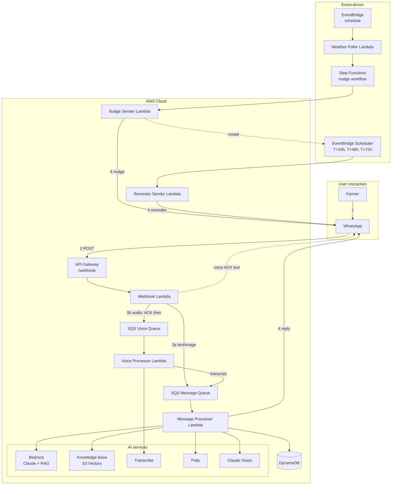
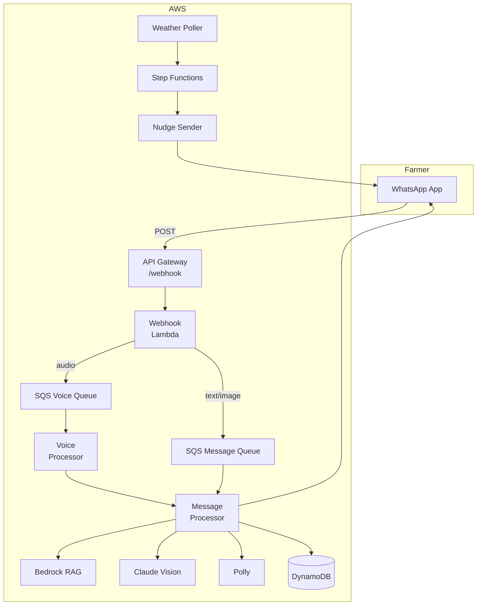
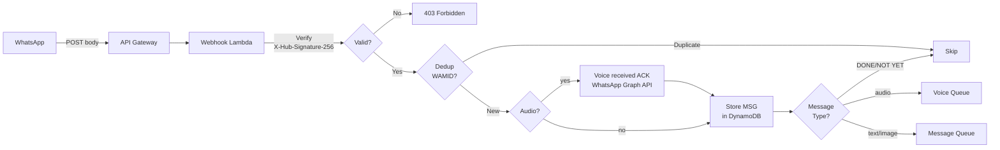
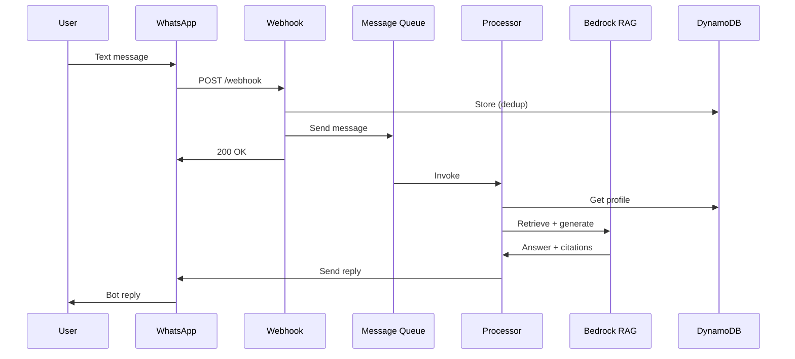
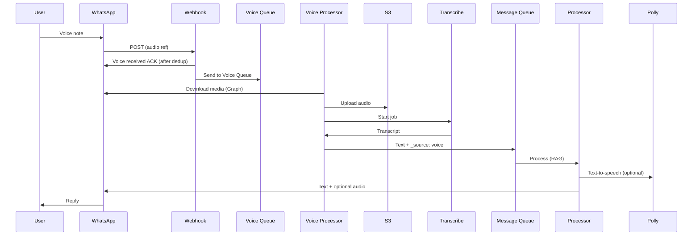
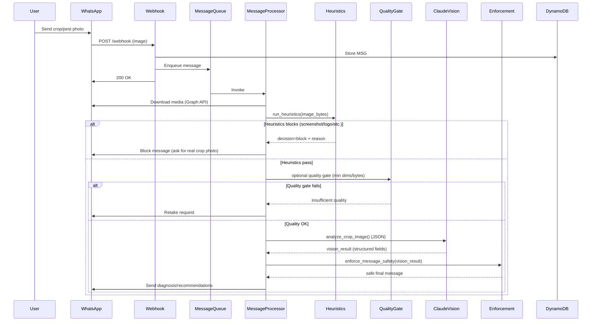
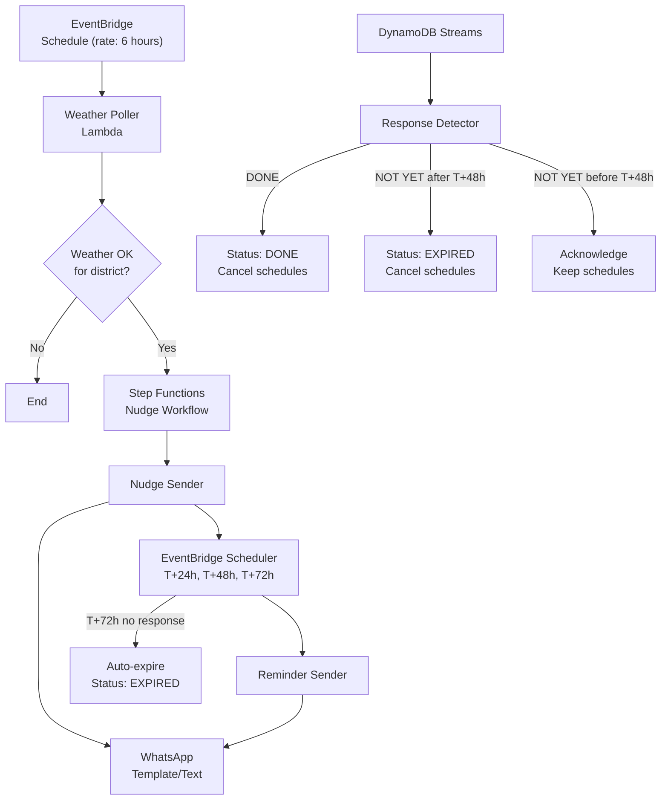
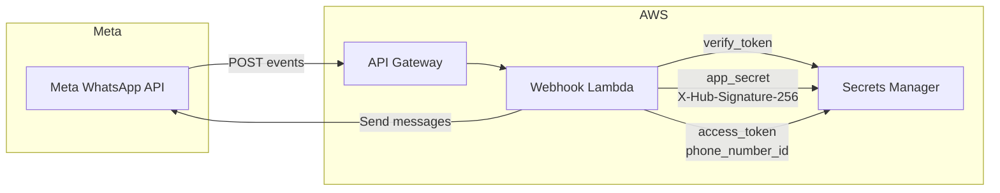

# Architecture Diagrams

Mermaid diagrams for AgriNexus AI. Rendered on GitHub. These stay **accuracy-first** (and may look plain compared to slide decks).

For slide-ready / article figures (PNG / GIF / MP4), see:
- [`../docs/diagrams/`](../docs/diagrams/)
- [`./polished/`](./polished/)

## System architecture (competition-style, accurate)

Use this for slides or a single “system architecture” image. It matches the actual code: **Webhook Lambda → SQS → Processor Lambdas** for messages; **Step Functions only for nudges**; **Lambdas call WhatsApp API directly** for outbound.

**Flow summary:** (1) Farmer → WhatsApp. (2) WhatsApp → API Gateway → Webhook Lambda. (3) Webhook → SQS (message or voice queue) → Message Processor or Voice Processor. For **audio**, webhook sends a short **voice-received** text (after dedup, before queue) using Secrets Manager + Graph API. **Transcribe** runs only in **Voice Processor**; Message Processor uses Bedrock RAG, Polly, Vision. (4) Processors and nudge/reminder Lambdas send replies **directly to WhatsApp Cloud API** (HTTP). Nudges: EventBridge → Weather Poller → Step Functions → Nudge Sender → WhatsApp; reminders via EventBridge Scheduler → Reminder Sender → WhatsApp.

**Demo vs full nudge loop:** New **`PROFILE`** items default to **`demo_tier: public`** — users get **one** nudge per favorable weather run, **without** T+24h/T+48h reminders. Override in DynamoDB for full scheduling.

---

## High-level system

## Webhook and routing

## Text message flow

## Voice message flow

## Vision (image) flow

This is the **image path** through the production pipeline: WhatsApp image → webhook → SQS → processor → deterministic gates → Claude Vision → last‑mile enforcement → WhatsApp.

## Nudge flow

## WhatsApp integration (secrets and webhook)

**Secrets (Secrets Manager):**

| Secret name | Purpose |
|-------------|---------|
| `agrinexus/whatsapp/verify-token` | GET webhook verification (hub.verify_token) |
| `agrinexus/whatsapp/app-secret` | HMAC signature verification (X-Hub-Signature-256) |
| `agrinexus/whatsapp/access-token` | Send messages via WhatsApp Cloud API (processor, nudge, **webhook** voice ACK) |
| `agrinexus/whatsapp/phone-number-id` | Sender phone number ID |

The **webhook** Lambda uses the Common layer and these two secrets to send the **voice-received** text for inbound audio (after dedup; see `src/webhook/handler.py`).

**Webhook:** `https://<api-id>.execute-api.<region>.amazonaws.com/dev/webhook`  
- **GET:** `hub.mode=subscribe&hub.verify_token=<token>&hub.challenge=<challenge>` → return `hub.challenge`.  
- **POST:** Incoming messages; validate signature, then queue for processing.
