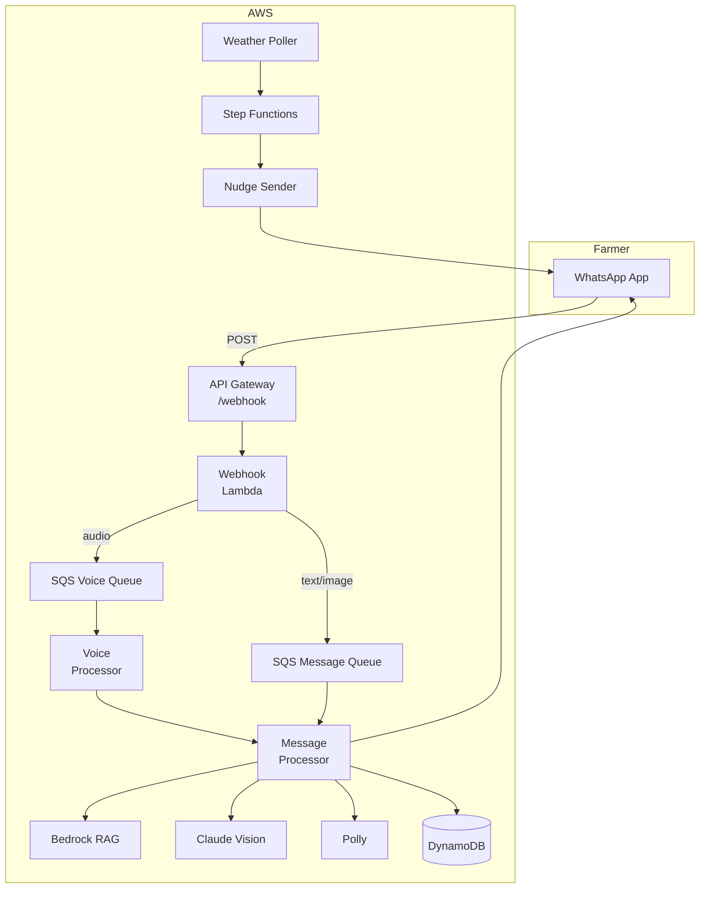
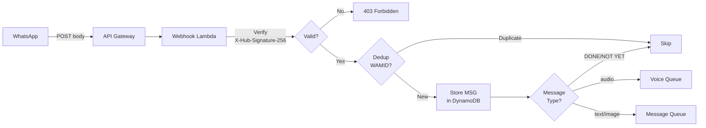
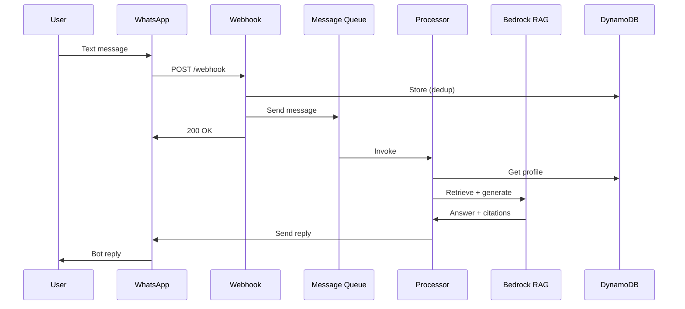
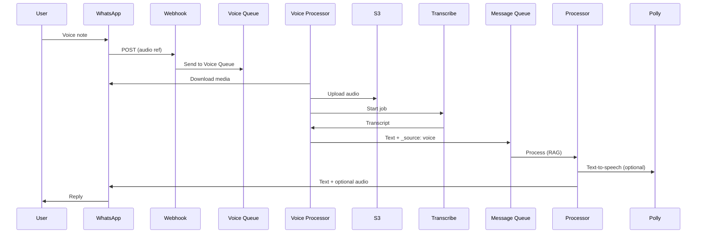
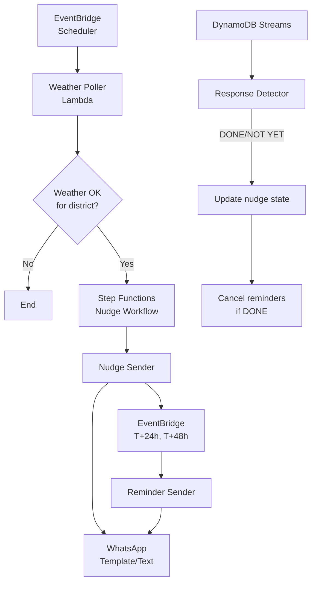
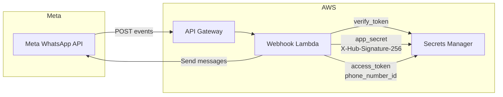

# Architecture Diagrams

Mermaid diagrams for AgriNexus AI. Rendered on GitHub.

## High-level system

## Webhook and routing

## Text message flow

## Voice message flow

## Nudge flow

## WhatsApp integration (secrets and webhook)

**Secrets (Secrets Manager):**

| Secret name | Purpose |
|-------------|---------|
| `agrinexus/whatsapp/verify-token` | GET webhook verification (hub.verify_token) |
| `agrinexus/whatsapp/app-secret` | HMAC signature verification (X-Hub-Signature-256) |
| `agrinexus/whatsapp/access-token` | Send messages via WhatsApp Cloud API |
| `agrinexus/whatsapp/phone-number-id` | Sender phone number ID |

**Webhook:** `https://<api-id>.execute-api.<region>.amazonaws.com/dev/webhook`  
- **GET:** `hub.mode=subscribe&hub.verify_token=<token>&hub.challenge=<challenge>` → return `hub.challenge`.  
- **POST:** Incoming messages; validate signature, then queue for processing.
