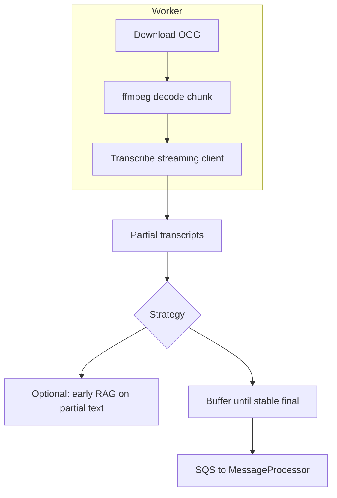

# Voice latency — Phase 2 plan (judge feedback + architecture)

## Goal

Judges called out **batch transcription latency** (roughly tens of seconds end-to-end). Phase 1 improvements (immediate first poll + adaptive intervals + honest article copy) help, but do **not** change the fundamental **batch Transcribe** model.

This document plans **Phase 2**: materially lower **time-to-first-text** and/or **time-to-full-transcript** using patterns that fit **WhatsApp voice notes** (complete OGG/OPUS file) and **AWS**.

---

## Current path (baseline)

**Bottleneck:** Service-side batch processing of the whole file + synchronous Lambda wait (up to timeout 90s). Polling only reduces **detection delay** after the job completes.

---

## Option A — Amazon Transcribe **streaming** (real-time / partial transcripts)

**Idea:** Send **audio chunks** to the **Transcribe streaming** API (WebSocket / HTTP/2 streaming). You get **partial** transcripts in **~seconds** after audio starts flowing.

**Reality for WhatsApp:** Meta gives you a **finished** media object. You must:

1. **Download** the file (same as today).
2. **Decode** OGG/OPUS to **PCM or another streamable format** (often **ffmpeg** in a **Lambda layer** or **container image**).
3. Open a **streaming session** to Transcribe and **write chunks** as they are produced (or in small time windows).

**Architecture sketch:**

**Where it runs**

| Host | Pros | Cons |
|------|------|------|
| **Lambda (container + ffmpeg layer)** | Fits serverless story | Package size, cold start, 15 min max; streaming I/O must fit execution model |
| **Fargate one-shot task** | Natural for long streams, ffmpeg sidecar | Ops + cost for always-on pool vs on-demand |
| **ECS task** | Same as Fargate | Same |

**IAM:** Add `transcribe:StartStreamTranscription` (and streaming-specific actions per current IAM docs).

**Product decisions**

- **Partial text → RAG:** Risky (incomplete question). Safer: show **“सुन रहे हैं…”** / **typing** UX on partials, run RAG only on **final** or **sentence-boundary** transcript.
- **Languages:** Confirm **hi-IN / mr-IN / te-IN / en-IN** streaming support matches batch.

**Effort (rough):** **1–2+ weeks** for production quality (ffmpeg reliability, retries, metrics, failure modes), not counting load testing.

---

## Option B — **Async batch** + strong **perceived** latency (no streaming)

**Idea:** Keep **batch** Transcribe (proven, simple) but **do not block** the user experience on Lambda finishing.

1. **VoiceProcessor** starts `StartTranscriptionJob`, writes **job id + wamid** to **DynamoDB**, sends immediate WhatsApp: **“आपकी आवाज़ मिल गई, जवाब तैयार कर रहे हैं…”**
2. **Completion:** Use **EventBridge** if you add a **custom poller** or **Step Functions** loop with backoff (or **SNS** from a small scheduled poller). On completion, enqueue **MessageProcessor** as today.

**Pros:** Smaller code churn than streaming; **perceived** latency drops to **sub-second** for acknowledgment.  
**Cons:** **True** answer still arrives after batch completes; you still pay batch time.

**Effort:** **~3–5 days** if you already have idempotent SQS patterns.

---

## Option C — **Hybrid**

- **Short clips** (e.g. &lt;15s): streaming path (Option A) for **fast** final transcript.
- **Long clips**: batch (Option baseline) or async batch (Option B).

Requires **duration detection** (ffprobe/ffmpeg) or WhatsApp metadata if available.

---

## Recommendation (phased)

| Phase | What | Addresses judge feedback |
|-------|------|---------------------------|
| **Now (shipped)** | Batch + smart polling + honest “What I learned” | Shows responsiveness to feedback without over-claiming |
| **Next (1 sprint)** | **Option B** async + instant acknowledgment message | Big **perceived** win, lower risk than streaming |
| **Then (1–2 sprints)** | **Option A** streaming pilot on **one** dialect + **dev** stack | Real **latency** reduction; story for “Phase 2” in articles / demos |

**Competition / demo:** Tight **video editing** still valid: show acknowledgment + trimmed wait; article should describe **Phase 2** as **planned architecture**, not shipped, unless you actually deploy streaming.

---

## Checklist before implementing Option A

- [ ] Confirm **Transcribe streaming** language codes for **mr-IN / te-IN** vs batch parity.
- [ ] Prototype **ffmpeg** decode OGG → PCM in target runtime (Lambda container vs Fargate).
- [ ] Define **SLA**: max voice length (truncate? reject & ask for shorter note?).
- [ ] CloudWatch: **time-to-first-partial**, **time-to-final**, error rate.
- [ ] **Git branch** `feature/transcribe-streaming` + deploy **dev** only; keep batch path behind **feature flag** for rollback.

---

## References

- [Amazon Transcribe streaming](https://docs.aws.amazon.com/transcribe/latest/dg/streaming.html) (official)
- Current implementation: [`src/voice/processor.py`](../src/voice/processor.py), SAM [`template-week2.yaml`](../template-week2.yaml) (`VoiceProcessor`, timeout 90s)
